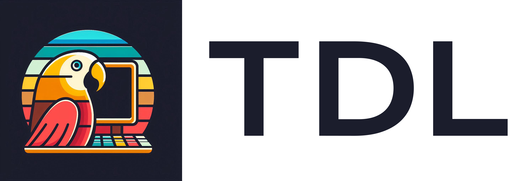
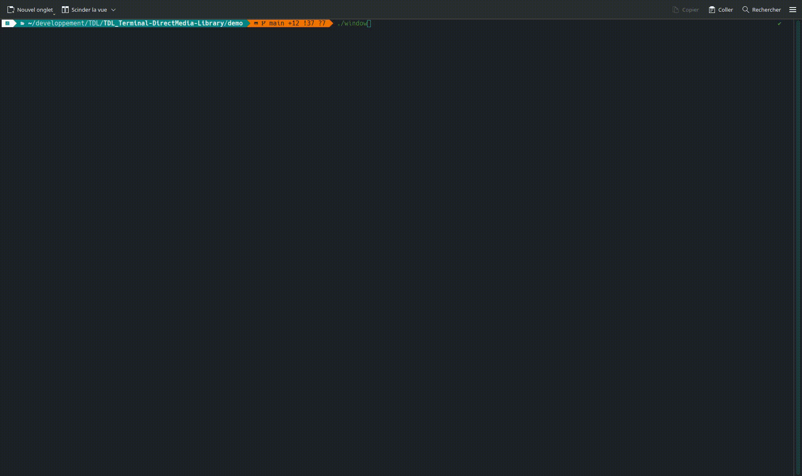
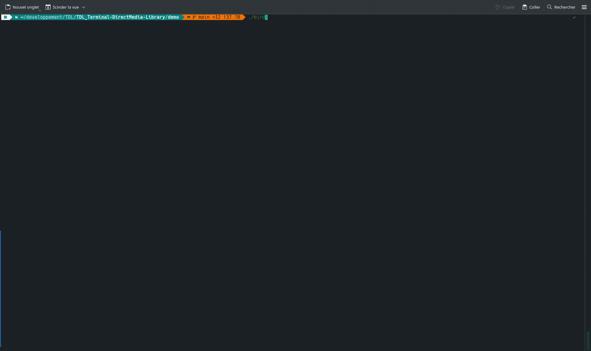

[//]: # ( [MermaidChart: b8cb3274-dd5a-4ce9-b674-c1cf4af51848]
<div align="center">
  
</div>

<div align="center">
  <h1>Terminal Direct Media Library</h1>
</div>

[](LICENSE)


---

## 📒 Overview

### Purpose
TDL is a C++ library that aims to provide a simple and easy-to-use interface for creating terminal-based applications. It is designed to be a lightweight and efficient solution for creating games, applications, and other software that can run in a terminal.

### Features

- **Window Management**: Create and manage terminal windows with ease.
- **Texture and Sprite Management**: Load and display images in the terminal.
- **Event Handling**: Handle keyboard / mouse input and other events.
- **Sound and Music**: Play sound effects and music in the terminal.
- **Text Rendering**: Render text in the terminal with different fonts and styles.
- **Works on graphical terminals and TTYS**: TDL works on both graphical terminals and TTYS.

## 🚀 Install

### Dependencies

To build and use TDL, you need the following dependencies:

- CMake
- GCC or Clang
- FreeType2
- libpng
- openAl
- libsndfile
- pkg-config
- libalsa
- libevdev

if you want to install dependancies on ubuntu you can use the following command:
```
sudo apt-get install cmake g++ libfreetype6-dev libpng-dev libopenal-dev libsndfile1-dev pkg-config libalsa-ocaml-dev libevdev-dev
```

On ArchLinux you can use the following command:
```
sudo pacman -S cmake gcc freetype2 libpng openal libsndfile pkg-config alsa-lib libevdev
```

### From AUR

To install from the AUR you can find the link [here](https://aur.archLinux.org/packages/tdl_terminal_directmedia_library).

### From this repository

To install and use TDL in your project, please follow these steps:

1. Clone this repository.

2. Create build folders and run the following command inside:
```
cmake .. -DCMAKE_INSTALL_PREFIX=/usr/local/ -DBUILD_SHARED_LIBS=ON
cmake --build . --target install (you may need to run this as sudo)
```
The file should be correctly installed, and you can build your code using cmake and use the library.

## 🤖 Examples

Here is a simple example of how to create a window and display an image using TDL:

You can find more examples in the [examples](examples) folder. If you want to build the examples, you can use the following commands:

```
mkdir build
cd build
cmake .. -DBUILD_DEMO=ON -DBUILD_SHARED_LIBS=OFF
cmake --build .
```
The examples will be built in the `demo folder at the root of the repository.

### Display a window

<div align="left">
  
</div>

<details>
  <summary>C++ code</summary>

  ```cpp
  int main() {
      tdl::Window *win = tdl::Window::createWindow("WindowName");
      while (true) {
          win->clearPixel();
          win->update();
          win->draw();
      }
      return 0;
  }
  ```
</details>

### Display an image

<div align="left">
  
</div>

<details>
  <summary>C++ code</summary>

  ```cpp
  int main() {
      tdl::Window *win = tdl::Window::createWindow("WindowName");
      tdl::Texture *texture = new tdl::Texture("path/to/image.png");
      tdl::Sprite *sprite = new tdl::Sprite(texture);
      while (true) {
          win->clearPixel();
          win->drawSprite(sprite);
          win->update();
          win->draw();
      }
      return 0;
  }
  ```
</details>

## 📚 Documentation

You can find the documentation [here](doc/README.md).

## 📜 License

This project is licensed under the GPL-3 License - see the [LICENSE](LICENSE) file for details.

## 🌟 Contributing

TDL project contributing are very welcome! And you have a lot of ways to contribute from speaking about the project to contributing code. If you want to contribute to the project, please read the [CONTRIBUTING](CONTRIBUTING.md) file.
